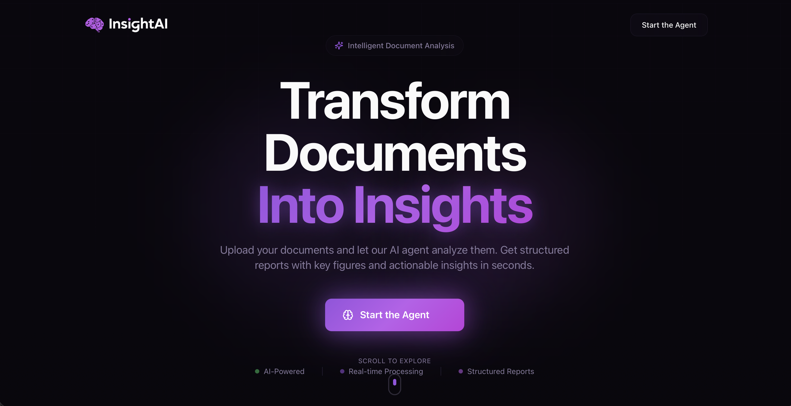
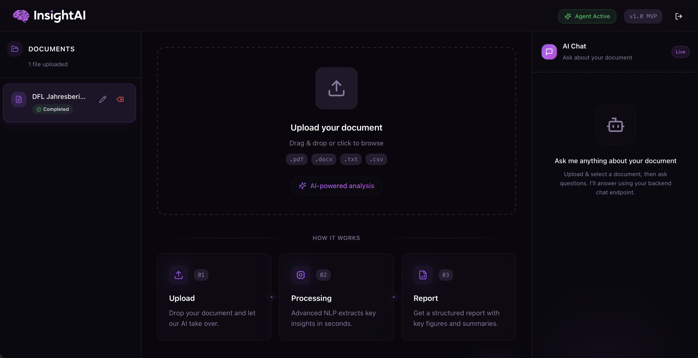
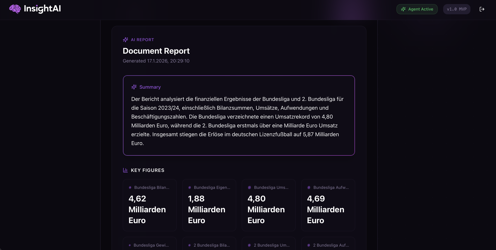

---

**InsightAI** is a modern, document-centric AI application designed to extract structured insights from unstructured data - built for scalability, collaboration, and real-world usage.

Users can upload **PDF, CSV, DOCX, and TXT files**, which are then parsed, chunked, embedded, and analyzed using a **Retrieval-Augmented Generation (RAG)** pipeline backed by a **Qdrant vector database**. The system generates professional, **multi-language AI reports** and enables a **document-aware chat experience** inside **personal and team workspaces**.

> **Status:**  
> ✅ Fully supports **multi-user team workspaces, document sharing, and role-based access**  
> ✅ Optimized for **PDF, CSV, DOCX, and TXT** processing

---

## 🖥️ User Interface Preview

### Landing Page & AI Architecture Overview

The landing page introduces InsightAI and explains how the agent works, including an overview of the underlying AI architecture and processing workflow.

<p align="center">
  
</p>

---

### Agent Dashboard

The agent dashboard provides access to uploaded documents, shows their processing status, and includes the document upload area along with a sneak preview of the document-aware AI chat.

<p align="center">
  
</p>

---

### AI-Generated Report Preview

This view shows a partial preview of an AI-generated report, demonstrating how extracted insights and structured content are presented to the user.

<p align="center">
  
</p>

---

## ⚡ Key Features

- **Document Upload:** Supports PDFs, CSVs, DOCXs and TXTs.
- **Scalable CSV Processing**  
  Memory-safe streaming & token-aware chunking.  
  Successfully tested with **25,000+ row CSV files**.
- **RAG-Based AI Reports**  
  Structured summaries, key figures, findings, risks, and conclusions generated strictly from document evidence.
- **Multi-Language Report Generation**
  Generate reports in any supported language directly from the dashboard (e.g. EN, DE, FR, ES, AR, CN etc.).
- **Interactive Chat:** Ask questions about your documents directly in the chat (first version available).
- **Team Workspaces & Collaboration**
  - Personal and shared team spaces
  - Role-based access (Owner / Member)
  - Secure document isolation
  - Member management
- **OpenAI + Gemini Fallback**  
  Automatic fallback to **Google Gemini** when OpenAI hits:
  - 429 rate limits  
  - token limits  
  - temporary API failures
- **Robust Processing Pipeline**  
  Chunking, embedding, **Qdrant-based vector storage**, block structuring, and reporting are fully decoupled.
- **Responsive UI:** Optimized for desktop and mobile devices.  

---

## 🛠 Installation

### Prerequisites

- Node.js >= 18  
- Python >= 3.10  
- Git  

### Quick Start (macOS / Linux / Windows PowerShell)

```bash
# Clone the repository
git clone https://github.com/ilyassuelen/InsightAI
cd InsightAI
```

#### Vector Database (Qdrant)
InsightAI uses **Qdrant** as its vector database for embeddings and retrieval.

Make sure Docker is running, then start Qdrant locally:

```bash
docker run -p 6333:6333 -p 6334:6334 \
  -v $(pwd)/backend/storage/qdrant_storage:/qdrant/storage \
  qdrant/qdrant
```

```bash
# Backend setup
cd backend
python -m venv .venv

# Linux/macOS
source .venv/bin/activate
# Windows PowerShell
.\.venv\Scripts\Activate.ps1

pip install -r requirements.txt
uvicorn backend.main:app --reload

# Frontend setup
cd ../frontend
npm install
npm run dev
```

## ⚙️ Configuration

Create a `.env` file in the **project root**:

| Name              | Required | Description                                                         |
|-------------------|----------|---------------------------------------------------------------------|
| OPENAI_API_KEY    | ✅        | OpenAI API key for AI report generation                             |
| GEMINI_API_KEY    | ❌        | Optional Gemini API key (automatic fallback)                        |
| QDRANT_URL        | ✅        | URL of the Qdrant vector database (default: http://localhost:6333)  |
| QDRANT_COLLECTION | ❌        | Qdrant collection name (default: insightai_chunks)                  |
| DATABASE_URL      | ❌        | Optional DB URL for PostgreSQL (defaults to SQLite)                 |


## Usage

1. Open the frontend in your browser at [http://localhost:8080](http://localhost:8080).
2. Start the Agent 
3. Register / Login
4. Use your own or create a workspace
5. Select your preferred report language in the dashboard.
6. Upload a Document via the Upload Zone.  
7. Wait for AI processing (status shown in sidebar).  
8. Click on the document to view the generated report.  
9. Use the chat panel to ask specific questions about the document.

## Tech Stack
- Frontend: React, TypeScript, Tailwind CSS, Framer Motion
- Backend: Python, FastAPI, Pydantic
- AI: OpenAI API (primary LLM), Google Gemini (automatic fallback), Retrieval-Augmented Generation (RAG)
- Vector Storage: **Qdrant**
- Database: SQLite (default) / PostgreSQL (configurable)
- State Management: React Hooks & Context

## Roadmap (Planned Features)
- API-connected data ingestion
- Advanced analytics & visualizations

## 🤝 Contributing
Contributions are welcome! Please follow these steps:
1.	Fork the repository.
2. Create a feature branch: git checkout -b feature/my-feature
3.	Commit your changes: git commit -m 'Add some feature'
4.	Push to the branch: git push origin feature/my-feature
5.	Open a Pull Request

## License
This project is licensed under the [MIT License](./LICENSE).
