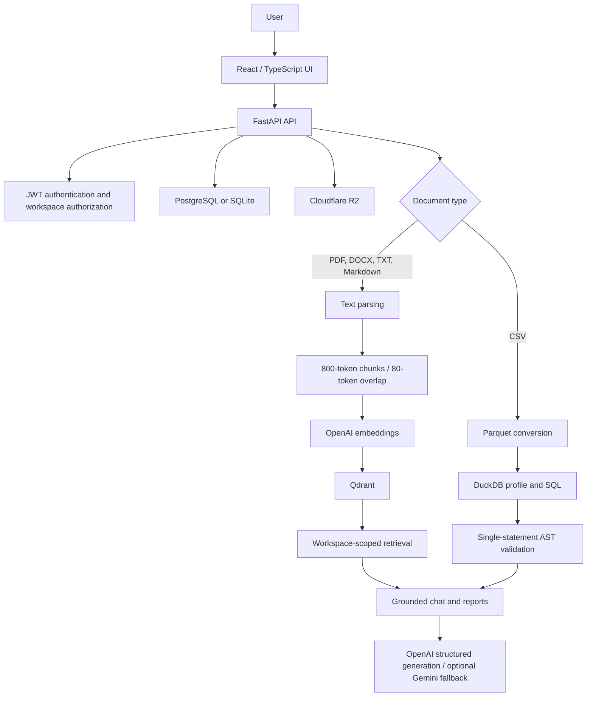

<p align="center">
  
</p>

<p align="center">
  Turn documents and tabular data into grounded reports and searchable workspace knowledge.
</p>

<p align="center">
  
  
  
  
  
  
</p>

## Overview

**InsightAI** is a multi-tenant document intelligence platform for PDF, DOCX, TXT, Markdown and CSV files. It combines workspace-scoped access, document processing, evidence-grounded generation and two deliberately separate analysis paths:

- **Text documents** use parsing, 800-token chunks with 80-token overlap, OpenAI embeddings, Qdrant retrieval and grounded LLM generation.
- **CSV files** use Parquet, DuckDB profiling and AST-validated read-only SQL instead of row-based RAG.

Users can create personal or shared workspaces, generate structured reports and ask questions across a workspace or within a selected document.

## Table of Contents

- [Demo](#demo)
- [Why InsightAI](#why-insightai)
- [Supported Formats](#supported-formats)
- [Architecture](#architecture)
- [Quick Start](#quick-start)
- [Configuration](#configuration)
- [Usage](#usage)
- [Testing](#testing)
- [Security and Data Boundaries](#security-and-data-boundaries)
- [Technology Stack](#technology-stack)
- [Project Structure](#project-structure)
- [Current Limitations](#current-limitations)
- [Roadmap](#roadmap)
- [Contributing](#contributing)
- [License](#license)

## Demo

<p align="center">
  
</p>

**Live frontend:** [insightai-lyart.vercel.app](https://insightai-lyart.vercel.app/)

> The hosted preview uses limited free-tier backend resources. For reliable document processing, run InsightAI locally or deploy the backend with production-grade resources.

## Why InsightAI?

- **Two analysis strategies:** semantic RAG for unstructured text and executed SQL for structured CSV data.
- **Structured reports:** summaries, sections, key figures, findings, risks, recommendations, charts, timelines and conclusions.
- **Workspace-scoped access:** personal and shared workspaces with Owner and Member roles.
- **Document and workspace chat:** retrieve evidence from one document or across authorized workspace documents.
- **Persistent private conversations:** resume, select and delete user-owned chat histories inside one fixed workspace/document context.
- **Controlled memory:** bounded recent turns help resolve explicit follow-up questions without becoming document evidence.
- **Validated uploads:** server-side format, size and content validation before storage.
- **Controlled chunking:** maximum 800 tokens, 80-token overlap and Unicode-safe boundaries.
- **Markdown awareness:** ATX and Setext headings create section boundaries; fenced code is excluded from heading detection.
- **DOCX structure awareness:** heading levels, nested lists and table rows remain visible to retrieval and reporting.
- **Hybrid retrieval:** semantic Qdrant search combined with relational keyword matching.
- **Structured CSV analysis:** Parquet storage, DuckDB profiling and exactly one AST-validated query against the `data` table.
- **Privacy-conscious observability:** optional Langfuse tracing based primarily on hashes, lengths and operational metadata.
- **Modern interface:** React dashboard for uploads, reports, workspaces and AI chat.

## Supported Formats

| Format | Parsing and preparation | Analysis path |
|---|---|---|
| PDF | Docling, OCR heuristic, contextual headings, 800-token limit | Embeddings, Qdrant and RAG |
| DOCX | Ordered headings, paragraphs, nested lists and Markdown-like tables; heading-aware 800/80 windows | Embeddings, Qdrant and RAG |
| TXT | UTF-8 text and 800/80 token windows | Embeddings, Qdrant and RAG |
| Markdown | Heading-aware sections and 800/80 windows inside each section | Embeddings, Qdrant and RAG |
| CSV | Validation, Parquet conversion and DuckDB profiling | AST-validated read-only SQL |

The default upload limit is **25 MiB** and can be changed with `MAX_UPLOAD_SIZE_MB`.

## Architecture


```mermaid
flowchart TD
    USER["User"] --> UI["React / TypeScript UI"]
    UI --> API["FastAPI API"]
    API --> AUTH["JWT authentication and workspace authorization"]
    API --> DB["PostgreSQL or SQLite"]
    API --> R2["Cloudflare R2"]
    API --> TYPE{"Document type"}

    TYPE -->|"PDF, DOCX, TXT, Markdown"| TEXT["Text parsing"]
    TEXT --> CHUNKS["800-token chunks / 80-token overlap"]
    CHUNKS --> EMB["OpenAI embeddings"]
    EMB --> QDRANT["Qdrant"]
    QDRANT --> RETRIEVAL["Workspace-scoped retrieval"]

    TYPE -->|"CSV"| PARQUET["Parquet conversion"]
    PARQUET --> DUCKDB["DuckDB profile and SQL"]
    DUCKDB --> SQLSAFE["Single-statement AST validation"]

    RETRIEVAL --> OUTPUT["Grounded chat and reports"]
    SQLSAFE --> OUTPUT
    OUTPUT --> LLM["OpenAI structured generation / optional Gemini fallback"]
```

### Text pipeline

1. Validate workspace membership, filename, size and actual file content.
2. Store the original object in R2 and create its relational document record.
3. Parse the document and create Unicode-safe chunks of at most 800 tokens.
4. Apply 80 tokens of overlap within hard token windows.
5. Preserve PDF context, Markdown headings and DOCX heading, list and table structure.
6. Generate `text-embedding-3-small` embeddings and store them in Qdrant.
7. Retrieve workspace-authorized evidence for chat and reports.
8. Generate structured output grounded in the retrieved content.

### CSV pipeline

1. Validate and store the CSV file.
2. Convert it to Parquet and create a DuckDB-based data profile.
3. Give the LLM the schema, summary and a small sample.
4. Parse the generated SQL into a DuckDB AST before any data download.
5. Allow exactly one read-only query and only the unqualified `data` table.
6. Reject external readers, table functions, additional statements and other tables.
7. Execute the accepted query and generate an answer from its result.

### Persistent chat and controlled memory

1. A new chat creates a private conversation owned by the current user and fixed to one workspace/document context.
2. User and assistant messages are stored relationally in deterministic sequence order.
3. Only the owner can list, open, continue or delete the conversation, and current workspace membership is checked again server-side.
4. The backend loads at most 20 recent stored messages, but only explicit follow-up questions activate prompt memory.
5. Prompt memory is limited to 8 messages, 1,200 tokens in total and 300 tokens per message.
6. Follow-up retrieval may include at most two earlier user questions; assistant answers never become retrieval evidence.
7. Memory is marked as untrusted context and can resolve references only. Answers remain grounded in retrieved document chunks or executed CSV SQL.

## Quick Start

### Prerequisites

- Python 3.10 or newer
- Node.js 18 or newer
- Git
- Docker for local Qdrant, or access to Qdrant Cloud
- An OpenAI API key
- A Cloudflare R2 bucket and API credentials for document uploads

### 1. Clone the repository

```bash
git clone https://github.com/ilyassuelen/InsightAI.git
cd InsightAI
```

All backend commands below must be run from the **project root**.

### 2. Create the backend environment

macOS and Linux:

```bash
python3 -m venv .venv
source .venv/bin/activate
python -m pip install --upgrade pip
python -m pip install -r requirements.txt
```

Windows PowerShell:

```powershell
py -m venv .venv
.\.venv\Scripts\Activate.ps1
python -m pip install --upgrade pip
python -m pip install -r requirements.txt
```

### 3. Configure the backend

Create `.env` in the project root:

```dotenv
OPENAI_API_KEY=your-openai-api-key
JWT_SECRET_KEY=replace-with-a-long-random-secret

QDRANT_URL=http://localhost:6333
QDRANT_COLLECTION=insightai_chunks

R2_ACCOUNT_ID=your-cloudflare-account-id
R2_ACCESS_KEY_ID=your-r2-access-key-id
R2_SECRET_ACCESS_KEY=your-r2-secret-access-key
R2_BUCKET=your-r2-bucket

CORS_ORIGINS=http://localhost:8080
```

SQLite is used automatically when `DATABASE_URL` is omitted.

### 4. Start Qdrant locally

```bash
docker volume create insightai_qdrant_data
docker run --name insightai-qdrant \
  -p 6333:6333 \
  -p 6334:6334 \
  -v insightai_qdrant_data:/qdrant/storage \
  qdrant/qdrant
```

If the container already exists, start it with:

```bash
docker start insightai-qdrant
```

Skip this step when using Qdrant Cloud and set `QDRANT_URL` and `QDRANT_API_KEY` accordingly.

### 5. Start the backend

```bash
uvicorn backend.main:app --reload
```

- API: [http://localhost:8000](http://localhost:8000)
- Interactive API documentation: [http://localhost:8000/docs](http://localhost:8000/docs)

### 6. Install and start the frontend

In a second terminal:

```bash
cd frontend
npm install
npm run dev
```

The frontend is available at [http://localhost:8080](http://localhost:8080).

The local API URL defaults to `http://localhost:8000`. For another backend, create `frontend/.env`:

```dotenv
VITE_API_BASE_URL=https://your-backend.example.com
```

## Configuration

### Backend environment

| Variable | Requirement | Default or purpose |
|---|---|---|
| `OPENAI_API_KEY` | Required | Chat, structured generation and embeddings |
| `GEMINI_API_KEY` | Optional | Fallback for structured JSON generation |
| `GOOGLE_API_KEY` | Optional | Alternative name for `GEMINI_API_KEY` |
| `DATABASE_URL` | Optional | Defaults to `sqlite:///./backend/database/insightai.db` |
| `JWT_SECRET_KEY` | Required in production | Development fallback exists and must not be used in production |
| `QDRANT_URL` | Optional for local use | Defaults to `http://localhost:6333` |
| `QDRANT_API_KEY` | Required for protected Qdrant Cloud | Not needed for an unsecured local instance |
| `QDRANT_COLLECTION` | Optional | Defaults to `insightai_chunks` |
| `R2_ACCOUNT_ID` | Required for uploads | Cloudflare account identifier |
| `R2_ACCESS_KEY_ID` | Required for uploads | R2 access key |
| `R2_SECRET_ACCESS_KEY` | Required for uploads | R2 secret key |
| `R2_BUCKET` | Required for uploads | R2 bucket name |
| `LANGFUSE_PUBLIC_KEY` | Optional | Enables observability when all Langfuse values are set |
| `LANGFUSE_SECRET_KEY` | Optional | Langfuse secret key |
| `LANGFUSE_HOST` | Optional | Langfuse host URL |
| `CORS_ORIGINS` | Optional | Comma-separated origins; includes local Vite ports by default |
| `MAX_UPLOAD_SIZE_MB` | Optional | Positive integer; defaults to `25` |

### Frontend environment

| Variable | Requirement | Default or purpose |
|---|---|---|
| `VITE_API_BASE_URL` | Optional locally, required for remote backends | Defaults to `http://localhost:8000` |

Never commit API keys, JWT secrets, R2 credentials or production database URLs.

## Usage

1. Open [http://localhost:8080](http://localhost:8080).
2. Register or sign in.
3. Select your personal workspace or create a team workspace.
4. Choose the report language.
5. Upload a supported document.
6. Follow its processing status in the document sidebar.
7. Open the completed structured report.
8. Ask questions in workspace-wide or document-specific chat.
9. Start, resume or delete private conversations from the chat-history selector.

## Testing

Install frontend dependencies first, activate the backend virtual environment and run:

```bash
python tests/run_all.py
```

The test runner performs:

- backend unit and API integration tests
- frontend Node/SSR component tests
- TypeScript validation
- ESLint validation
- a production frontend build in a temporary directory

Routine tests mock OpenAI, Gemini, Qdrant, R2 and Langfuse instead of calling live services.

Individual checks can also be run directly:

```bash
python -m unittest discover -s tests/backend -t . -v
cd frontend
npm run lint
npm run build
```

## Security and Data Boundaries

InsightAI applies several defensive controls:

- workspace membership is checked server-side before sensitive document operations
- workspace and document filters are applied during retrieval
- upload extension, size and actual content are validated before R2 storage
- failed uploads and database commits trigger compensating R2 cleanup attempts
- document and query embeddings use the same model and vector space
- CSV SQL is parsed structurally before execution
- CSV queries are restricted to one statement and the `data` table
- table functions and external CSV/Parquet readers are rejected
- generated reports use structured schemas and evidence-oriented prompts
- document evidence and derived report drafts are explicitly marked as untrusted data rather than instructions
- report headings are fixed server-side and reported source IDs are validated against retrieved chunks
- chat histories are private to their creator and cannot be moved between workspace or document contexts
- conversation memory is token-bounded, activated only for explicit follow-ups and marked as untrusted, non-evidentiary context
- observability avoids raw content where the current tracing path supports metadata-only logging

These controls reduce risk but do not replace deployment hardening, secret management, monitoring, backups, malware scanning or an independent security review.

## AI Provider Behavior

- Primary generation model: `gpt-4o-mini`
- Embedding model: `text-embedding-3-small`
- Structured-generation fallback: `gemini-2.5-flash`
- Direct text chat uses OpenAI without an equivalent Gemini fallback.
- Embeddings intentionally remain OpenAI-only to preserve vector compatibility.

## Technology Stack

| Area | Technologies |
|---|---|
| Frontend | React, TypeScript, Vite, Tailwind CSS, Framer Motion |
| Backend | FastAPI, Python, Pydantic, SQLAlchemy |
| Text parsing | Docling, PyMuPDF, python-docx, Tiktoken |
| AI | OpenAI, optional Google Gemini fallback |
| Retrieval | Qdrant and relational keyword search |
| Structured data | Pandas, PyArrow, Parquet and DuckDB |
| Persistence | PostgreSQL or SQLite, Cloudflare R2 |
| Observability | Optional Langfuse |
| Deployment | Vercel, Render, Neon, Qdrant Cloud and Cloudflare R2 |

## Project Structure

```text
InsightAI/
├── backend/
│   ├── parsers/               # PDF, DOCX and text parsing
│   ├── routers/               # FastAPI endpoints
│   ├── models/                # SQLAlchemy models
│   └── services/
│       ├── ingestion/         # Chunking and semantic blocks
│       ├── vector/            # Qdrant and hybrid retrieval
│       ├── reporting/         # Structured report generation
│       ├── csv/               # Parquet, DuckDB, SQL and CSV reports
│       ├── auth/              # JWT and password handling
│       ├── storage/           # R2 and upload validation
│       └── observability/     # Langfuse integration
├── frontend/src/              # React application
├── tests/                     # Backend and frontend test suites
├── docs/                      # Architecture, decisions and project guidance
├── requirements.txt
└── render.yaml
```

## Current Limitations

- CSV-to-Parquet conversion currently loads the complete CSV through Pandas; it is not yet a streaming conversion.
- Document processing uses FastAPI `BackgroundTasks`, not a persistent job queue.
- A versioned synthetic RAG goldset exists, but retrieval and answer-quality baseline metrics have not yet been executed.
- The active 800/80 chunk strategy increases embedding and vector volume for long documents.
- Existing documents must be reprocessed to adopt a changed chunking strategy.
- TXT does not yet preserve document structure beyond its plain-text content.
- DOCX tables are normalized for retrieval, but merged cells and advanced Word layout semantics are not reconstructed.
- Retrieval does not yet use calibrated rank fusion, a reranker or a measured minimum relevance threshold.
- Query timeouts and explicit DuckDB CPU/memory limits remain planned hardening work.

## Roadmap

Current priorities include:

- a reproducible Recall@K, MRR and grounding baseline on the versioned RAG goldset
- rank fusion, reranking and relevance thresholds
- more structure-aware TXT chunking and adaptive boundaries for oversized DOCX sections
- precise inline citations and source highlighting
- persistent background jobs with retry, resume and failure recovery
- streaming CSV-to-Parquet conversion
- query timeouts and DuckDB resource limits

## Deployment

A typical hosted setup uses:

- Vercel for the frontend
- Render for the backend
- Neon PostgreSQL
- Qdrant Cloud
- Cloudflare R2

Set `VITE_API_BASE_URL` to the deployed backend URL and configure `CORS_ORIGINS` with the deployed frontend origin.

## Contributing

Contributions are welcome.

1. Fork the repository.
2. Create a focused branch:

   ```bash
   git checkout -b feature/my-feature
   ```

3. Implement and test the change.
4. Commit with a descriptive message:

   ```bash
   git commit -m "feat: describe the change"
   ```

5. Push the branch and open a pull request.

Please follow the [Code of Conduct](CODE_OF_CONDUCT.md). Keep changes focused, preserve workspace isolation and add proportional tests for changed behavior.

## License

InsightAI is available under the [MIT License](LICENSE).
