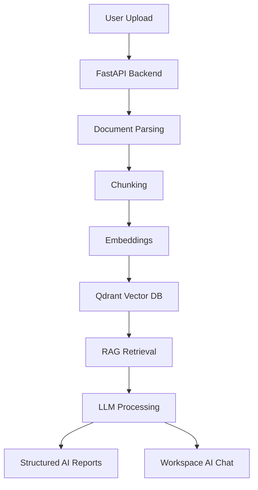

<p align="center">
  
</p>
> Transform PDF, CSV, DOCX and TXT files into structured AI reports and searchable knowledge.


---

**InsightAI** is an AI-powered document intelligence platform for analyzing PDF, CSV, DOCX and TXT files using Retrieval-Augmented Generation (RAG) and scalable LLM pipelines.

The system supports **automated parsing, intelligent chunking, Qdrant-based vector retrieval, structured AI report generation, and workspace-wide AI chat across uploaded documents**.

> **Current Capabilities:**  
> - Multi-user team workspaces  
> - Role-based access control
> - Workspace-scoped document isolation
> - AI-powered structured reporting
> - Workspace-wide document chat
> - Multi-format ingestion (PDF, CSV, DOCX, TXT)

---

## 🖥️ User Interface Preview

### 🎬 Application Demo

Short walkthrough showing the full InsightAI UI.

<p align="center">
  
</p>

---

## Live Preview

Frontend preview: https://insightai-lyart.vercel.app/

> Note: The hosted preview runs with limited free-tier backend resources.  
> For reliable document processing, run the project locally or deploy the backend on a production-grade instance.

---

## ⚡ Key Features

- **Document Upload:** Supports PDF, CSV, DOCX and TXT files.
- **Scalable CSV Processing**  
  Memory-safe streaming & token-aware chunking.  
  Successfully tested with **25,000+ row CSV files**.
- **RAG-Based AI Reports**  
  Structured summaries, key figures, findings, risks, and conclusions generated strictly from document evidence.
- **Multi-Language Report Generation**
  Generate reports in any supported language directly from the dashboard (e.g. EN, DE, FR, ES, AR, CN etc.).
- **Workspace-Wide AI Chat & Retrieval:** Ask questions across all uploaded workspace documents using semantic retrieval and RAG-based context generation.
- **Team Workspaces & Collaboration**
  - Personal and shared team spaces
  - Role-based access (Owner / Member)
  - Secure document isolation
  - Member management
- **Workspace-Scoped Retrieval**  
  Vector search and document retrieval are strictly isolated per workspace to ensure secure multi-user environments.
- **OpenAI + Gemini Fallback**  
  Automatic fallback to **Google Gemini** when OpenAI hits:
  - 429 rate limits  
  - token limits  
  - temporary API failures
- **Robust Processing Pipeline**  
  Chunking, embedding, **Qdrant-based vector storage**, block structuring, reporting and **LLM tracing via Langfuse** for debugging and monitoring.
- **Modern AI Workspace Interface:** Glassmorphism-inspired dashboard optimized for structured reporting, document intelligence workflows, and collaborative AI analysis.

---

## 🛠 Installation

### Prerequisites

- Node.js >= 18  
- Python >= 3.10  
- Git  

### Quick Start (macOS / Linux / Windows PowerShell):

#### 1. Clone the repository
```bash
git clone https://github.com/ilyassuelen/InsightAI
cd InsightAI
```

#### 2. Vector Database (Qdrant)
InsightAI uses **Qdrant** as the vector database and supports both:
- local Qdrant instances
- hosted Qdrant Cloud clusters

For local development, you can start Qdrant via Docker:

```bash
docker run -p 6333:6333 -p 6334:6334 \
  -v $(pwd)/backend/storage/qdrant_storage:/qdrant/storage \
  qdrant/qdrant
```

#### 3. Start Backend

```bash
# Backend setup
cd backend
python -m venv .venv

# Linux/macOS
source .venv/bin/activate
# Windows PowerShell
.\.venv\Scripts\Activate.ps1

pip install -r requirements.txt
uvicorn backend.main:app --reload
```

#### 4. Start Frontend

```bash
cd ../frontend
npm install
npm run dev
```

## ⚙️ Configuration

Create a `.env` file in the **project root**:

| Name                | Required | Description                                                        |
|---------------------|----------|--------------------------------------------------------------------|
| OPENAI_API_KEY      | ✅        | OpenAI API key for AI report generation                            |
| GEMINI_API_KEY      | ❌        | Optional Gemini API key (automatic fallback)                       |
| QDRANT_URL          | ✅        | URL of the Qdrant vector database (default: http://localhost:6333) |
| QDRANT_COLLECTION   | ❌        | Qdrant collection name (default: insightai_chunks)                 |
| JWT_SECRET_KEY      | ✅        | Secret key used for signing JWT authentication tokens              |
| LANGFUSE_PUBLIC_KEY | ❌        | Langfuse public key for LLM tracing                                |
| LANGFUSE_SECRET_KEY | ❌        | Langfuse secret key for LLM tracing                                |
| LANGFUSE_HOST       | ❌        | Langfuse host URL (e.g. https://cloud.langfuse.com)                |
| DATABASE_URL        | ❌        | Optional DB URL for PostgreSQL (defaults to SQLite if not set)     |


## Usage

1. Open the frontend in your browser at [http://localhost:8080](http://localhost:8080).
2. Register or login
3. Use your own or create a workspace
4. Select your preferred report language in the dashboard.
5. Upload a document (PDF, CSV, DOCX, TXT)  
6. Wait for AI processing (status shown in sidebar).  
7. Click on the document to view the generated report.  
8. Ask questions about uploaded documents in the chat

## Tech Stack
### Frontend
- React
- TypeScript
- Tailwind CSS
- Framer Motion

### Backend
- FastAPI
- Python
- Pydantic
- SQLAlchemy

### AI & Retrieval
- OpenAI
- Gemini (Fallback)
- Retrieval-Augmented Generation (RAG)
- Qdrant
- Langfuse

### Infrastructure & Deployment
- Frontend Hosting: Vercel
- Backend Deployment: Render
- Database: Neon PostgreSQL
- Vector Database: Qdrant Cloud
- Object Storage: Cloudflare R2
- Authentication: JWT

## Architecture

```mermaid
flowchart TD

A[User Upload] --> B[FastAPI Backend]

B --> C[Document Parsing]

C --> D[Chunking]

D --> E[Embeddings]

E --> F[Qdrant Vector DB]

F --> G[RAG Retrieval]

G --> H[LLM Processing]

H --> I[Structured AI Reports]

H --> J[Workspace AI Chat]
```

## Roadmap (Planned Features)
- API-connected data ingestion
- Advanced analytics & visualizations
- Semantic search improvements

## 🤝 Contributing
Contributions are welcome! Please follow these steps:
1.	Fork the repository.
2. Create a feature branch: git checkout -b feature/my-feature
3.	Commit your changes: git commit -m 'Add some feature'
4.	Push to the branch: git push origin feature/my-feature
5.	Open a Pull Request

## License
This project is licensed under the [MIT License](./LICENSE).
